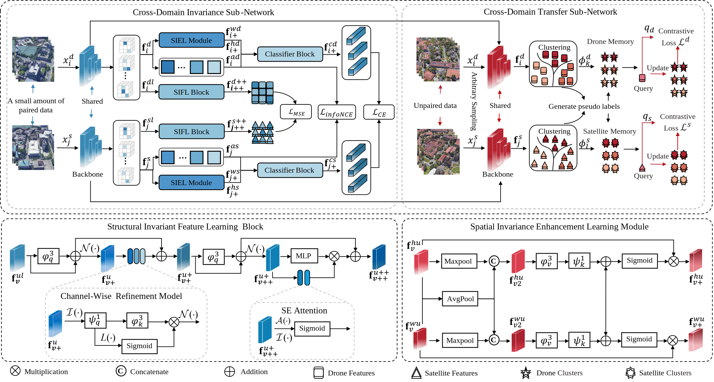
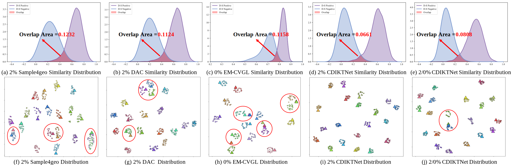

## CDIKTNet 2025 [[paper](https://arxiv.org/abs/2503.07520)][[model](#pre-trained-checkpoints)] [[Cite](#Citation)]
<p align="center">
  <p align="left">
    
  <p align="left">
<h1 align="center">From Limited Labels to Open Domains:An Efficient Learning Method for Drone-view Geo-Localization</h1>
<h3 align="center"><strong>Zhongwei Chen</strong><sup>1,2,3</sup>, <strong>Zhaoxu Yang*</strong><sup>1,2,3</sup>, <strong>Haijun Rong*</strong><sup>1,2,3</sup>, <strong>Jiawei Lang*</strong><sup>1,2,3</sup>,<strong>Guoqi Li</strong><sup>4,5,6</sup></h3>

<div align="center">
  <sup>1</sup>School of Aerospace Engineering, Xi'an Jiaotong University China<br>
  <sup>2</sup>State Key Laboratory for Strength and Vibration of Mechanical Structures<br>
  <sup>3</sup>Shaanxi Key Laboratory of Environment and Control for Flight Vehicle<br>
  <sup>4</sup>Institute of Automation, Chinese Academy of Sciences, China<br>
  <sup>5</sup>School of Artificial Intelligence, University of Chinese Academy of Sciences<br>
  <sup>6</sup>Peng Cheng Laboratory
</div>
  <p align="center">
    
    
    
  <p align="center">

This repository is the official implementation of the paper "Efficient Spike-driven Transformer for High-performance Drone-View Geo-Localization". 
The current version of the repository can cover the experiments reported in the paper, for researchers in time efficiency. And we will also update this repository for better understanding and clarity.

## <a id="table-of-contents"></a> 📚 Table of contents

- [TODOs](#todos)
- [Dataset Access](#dataset-access)
- [Dataset Structure](#dataset-structure)
- [Train and Test](#train-and-test)
- [Pre-trained Checkpoints](#pre-trained-checkpoints)
- [License](#license)
- [Acknowledgments](#acknowledgments)
- [Citation](#citation)

## <a id="todos"></a> 📜 TODOs

- [x] Release the **training** code
- [x] Release the **evaluation** (testing) code
- [x] Release the **pretrained weights** of SpikeViMFormer

## <a id="dataset-access"></a> 💾 Dataset Access
Please prepare [University-1652](https://github.com/layumi/University1652-Baseline), [SUES-200](https://github.com/Reza-Zhu/SUES-200-Benchmark)

## <a id="dataset-structure"></a> 📁 Dataset Structure

### University-1652 Dataset Directory Structure
```
├── University-1652/
│   ├── train/
│       ├── drone/                   /* drone-view training images 
│           ├── 0001
|           ├── 0002
|           ...
│       ├── satellite/               /* satellite-view training images       
│   ├── test/
│       ├── query_drone/  
│       ├── gallery_drone/  
│       ├── query_satellite/  
│       ├── gallery_satellite/ 
```
### SUES-200 Dataset Directory Structure
```
├─ SUES-200
  ├── Training
    ├── 150/
    ├── 200/
    ├── 250/
    └── 300/
  ├── Testing
    ├── 150/
    ├── 200/ 
    ├── 250/	
    └── 300/
```

## <a id="train-and-test"></a> 🚀 Train and Test

For University-1652 Dataset
```
Train: run train_university.py, with --only_test = False.

Test: run train_university.py, with --only_test = True, and choose the model in --ckpt_path.
```
For SUES-200 Dataset
```
Train: run train_SUES-200.py, with --only_test = False.

Test: run train_SUES-200.py, with --only_test = True, and choose the model in --ckpt_path.
```

## <a id="pre-trained-checkpoints"></a> 🤗 Pre-trained Checkpoints
We provide the trained models in the link below:

Link: [https://pan.baidu.com/s/1YPEV27tnadqCZBRCscTMTA : 6666]

We will update this repository for better clarity ASAP, current version is for quick research for researchers interested in the cross-view geo-localization task.

## <a id="license"></a> 🎫 License
This project is licensed under the [Apache 2.0 license](LICENSE).

## <a id="citation"></a> 📌 Citation

 If you find this code useful for your research, please cite our papers.

```bibtex
@article{chen2025efficient,
  title={Efficient Spike-driven Transformer for High-performance Drone-View Geo-Localization},
  author={Chen, Zhongwei, Yang, Zhao-Xu, Rong, Hai-Jun, Guoqi Li},
  journal={arXiv preprint arXiv:2512.19365},
  year={2025}
}
```
## <a id="acknowledgments"></a> 🙏 Acknowledgments
This repository is built using the [DAC](https://github.com/SummerpanKing/DAC), [Meta-SpikeFormer](https://github.com/BICLab/Spike-Driven-Transformer-V2), [E-SpikeFormer](https://github.com/BICLab/Spike-Driven-Transformer-V3) repositories. Thanks for their wonderful work.
